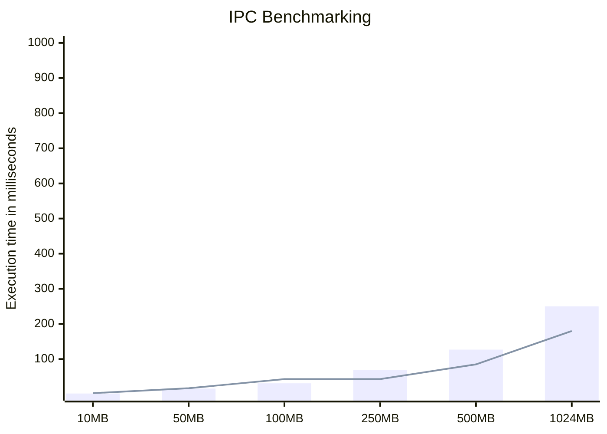

# IPC benchmarking

Tested on M1 MacBook Air 16GB RAM

```mermaid
xychart-beta
    title "IPC Benchmarking"
    x-axis [10MB, 50MB, 100MB, 250MB, 500MB, 1024MB]
    y-axis "Execution time in milliseconds" 1 --> 1000
    bar [2, 16, 31, 69, 127, 250]
    line [3, 17, 43, 43, 85, 180]
```
